# 👋 Hi, I'm Vinoth P

<div align="center">
  
[](https://git.io/typing-svg)

</div>

---

<div align="center">
  
### 🚀 Emerging AI Engineer | 🧠 Agentic AI Architect | ☁️ Cloud Native Developer

*Passionate about building intelligent systems that think, adapt, and solve real-world problems*

</div>

---

## 🎯 What I'm Building

```mermaid
mindmap
  root((Vinoth P))
    🤖 Agentic AI
      MCP Servers
      AI Agents
      Intelligent Systems
    ☁️ Cloud Architecture
      AWS & Azure
      Scalable Apps
      Microservices
    🧠 Deep Learning
      PyTorch & TensorFlow
      Computer Vision
      NLP Models
    💻 Full-Stack Dev
      React & Node.js
      FastAPI & Django
      Real-time Systems
```



---

## 💼 Current Focus

<table>
<tr>
<td width="50%">

### 🔭 Working On
- 🤖 **MCP Servers & AI Agents**
- ☁️ **Cloud-hosted Intelligent Systems**
- 🏗️ **Agentic AI Architectures**
- 🧠 **Deep Learning Models**
- 📱 **Scalable Software Applications**

</td>
<td width="50%">

### 🌱 Currently Learning
- 🌲 **DSA** (Trees, Graphs, Advanced)
- 🤖 **AI & Deep Learning**
- 🥽 **AR/VR Development**
- ⛓️ **Blockchain Fundamentals**
- 🚀 **Advanced System Design**

</td>
</tr>
</table>

---

## 🤝 Let's Collaborate

<div align="center">

| 💡 I'm interested in | 🆘 I need help with |
|:---:|:---:|
| AI Research & Experimental Intelligence | Building Strong Collaboration Teams |
| Full-Stack & Cloud-Native Apps | Creating Breakthrough Innovations |
| Agentic Frameworks & Automation | AI & Emerging Tech Projects |

</div>

---

## 💬 Ask Me About

<div align="center">


</div>

---

## 🌐 Connect With Me

<div align="center">

[](https://linkedin.com/in/vinoth-p-a41770290)
[](https://bsky.app/profile/vinocosmo.bsky.social)
[](https://x.com/vinocosmo)
[](https://discord.gg/82F8WjDW)
[](https://instagram.com/_vino_cosmo_)
[](https://reddit.com/user/vino_cosmo)
[](https://mastodon.social/@vinocosmo)
[](mailto:Vinoth322006@gmail.com)

</div>

---

## 🛠️ Technology Arsenal

### 👨‍💻 Programming Languages

<div align="center">


</div>

### ☁️ Cloud & DevOps

<div align="center">


</div>

### 🚀 Frameworks & Libraries

<div align="center">


</div>

### 🧠 AI/ML & Data Science

<div align="center">


</div>

### 🗄️ Databases

<div align="center">


</div>

### 🔧 Tools & Platforms

<div align="center">


</div>

---

## 📊 GitHub Analytics

<div align="center">
  


</div>

<div align="center">
  


</div>

---

## 🏆 GitHub Achievements

<div align="center">


</div>

---

## 📈 Contribution Graph

<div align="center">

[](https://github.com/vinoth322006)

</div>

---

## 💭 Daily Inspiration

<div align="center">


</div>

---

## 🎯 2025 Goals

```python
class Goals2025:
    def __init__(self):
        self.technical = [
            "Master Advanced AI Architectures",
            "Build 10+ Production-Ready AI Agents",
            "Contribute to Major Open Source Projects",
            "Launch Personal AI SaaS Product"
        ]
        self.learning = [
            "Deep dive into Reinforcement Learning",
            "Complete AR/VR Development Certification",
            "Master Blockchain & Web3 Technologies",
            "Advanced System Design Patterns"
        ]
        self.community = [
            "Mentor 50+ Aspiring Developers",
            "Write 24+ Technical Blog Posts",
            "Speak at 3+ Tech Conferences",
            "Build Active Developer Community"
        ]
    
    def execute(self):
        return "Building the future, one commit at a time! 🚀"
```

---

## 📫 Let's Build Together

<div align="center">

### 🤝 Open for collaboration on innovative AI projects!

**Interested in working together?** Reach out via [Email](mailto:Vinoth322006@gmail.com) or [LinkedIn](https://linkedin.com/in/vinoth-p-a41770290)

</div>

---

## ☕ Support My Work

<div align="center">

If you find my projects helpful or interesting, consider supporting my work!

[](https://buymeacoffee.com/vinocosmo)

</div>

---

<div align="center">

### 💡 *"Innovation distinguishes between a leader and a follower."* - Steve Jobs


**⭐ From [vinoth322006](https://github.com/vinoth322006) with 💙**

</div>

---

<div align="center">
  
[](https://github.com/vinoth322006)
[](https://github.com/vinoth322006)

</div>
