<div align="center">

<!-- Animated Banner -->


<!-- Typing Animation -->
<a href="https://git.io/typing-svg"></a>

<!-- Animated Subtitle -->
```ascii
╔══════════════════════════════════════════════════════════════╗
║  🌟 Emerging AI Engineer passionate about building the      ║
║     next generation of intelligent, adaptive systems        ║
╚══════════════════════════════════════════════════════════════╝
```

<!-- Profile Views Counter with Animation -->
<p align="center">
  
  
  
</p>

</div>

---

<!-- Animated Divider -->


## 🎯 Mission Control // Current Trajectory

<div align="center">

```yaml
Mission: "Building AI systems that don't just compute—they understand, adapt, and evolve"
Status: [ ████████████████████░░ ] 92% Focused
Current_Projects:
  - MCP_Servers: "Designing intelligent multi-agent communication protocols"
  - AI_Agents: "Creating autonomous systems with decision-making capabilities"
  - Cloud_Architecture: "Architecting scalable, cloud-native AI platforms"
  - Deep_Learning: "Pushing boundaries in neural network architectures"
Next_Milestone: "Launch production-ready AI SaaS platform Q1 2025"
```

</div>

---

<!-- Interactive Mind Map -->
## 🧠 Neural Network // Expertise Map

```mermaid
%%{init: {'theme':'dark', 'themeVariables': { 'primaryColor':'#00F5FF','primaryTextColor':'#fff','primaryBorderColor':'#00F5FF','lineColor':'#00F5FF','secondaryColor':'#1a1a2e','tertiaryColor':'#16213e'}}}%%
graph TB
    A[🚀 Vinoth P] --> B[🤖 AI/ML Engineering]
    A --> C[☁️ Cloud Architecture]
    A --> D[💻 Full-Stack Development]
    A --> E[🔬 Research & Innovation]
    
    B --> B1[Agentic AI Systems]
    B --> B2[Deep Learning Models]
    B --> B3[Computer Vision]
    B --> B4[NLP & LLMs]
    
    C --> C1[AWS & Azure]
    C --> C2[Microservices]
    C --> C3[Kubernetes & Docker]
    C --> C4[Serverless Architecture]
    
    D --> D1[React & Node.js]
    D --> D2[FastAPI & Django]
    D --> D3[Real-time Systems]
    D --> D4[Mobile Development]
    
    E --> E1[MCP Servers]
    E --> E2[AR/VR Exploration]
    E --> E3[Blockchain Integration]
    E --> E4[IoT Ecosystems]
    
    style A fill:#00F5FF,stroke:#00F5FF,stroke-width:4px,color:#000
    style B fill:#1a1a2e,stroke:#00F5FF,stroke-width:2px
    style C fill:#1a1a2e,stroke:#00F5FF,stroke-width:2px
    style D fill:#1a1a2e,stroke:#00F5FF,stroke-width:2px
    style E fill:#1a1a2e,stroke:#00F5FF,stroke-width:2px
```

<div align="center">



</div>

---

<!-- Activity Dashboard -->
## 📊 System Analytics // Performance Metrics

<div align="center">

<!-- 3D Contribution Graph -->


<br><br>

<!-- Stats Cards with Glowing Effect -->
<table>
  <tr>
    <td width="50%">
      
    </td>
    <td width="50%">
      
    </td>
  </tr>
</table>

<br>

<!-- Language Stats with Special Design -->


</div>

---

<!-- Trophy Showcase -->
## 🏆 Achievement Vault // Trophy Collection

<div align="center">


</div>

---

<!-- Technology Arsenal with Creative Layout -->
## 🛠️ Arsenal // Technology Stack

<div align="center">

### ⚡ Core Languages & Frameworks

<table>
  <tr>
    <td align="center" width="100">
      
      <br>Python
    </td>
    <td align="center" width="100">
      
      <br>JavaScript
    </td>
    <td align="center" width="100">
      
      <br>TypeScript
    </td>
    <td align="center" width="100">
      
      <br>C++
    </td>
    <td align="center" width="100">
      
      <br>Java
    </td>
    <td align="center" width="100">
      
      <br>React
    </td>
    <td align="center" width="100">
      
      <br>Django
    </td>
  </tr>
</table>

### ☁️ Cloud & DevOps

<table>
  <tr>
    <td align="center" width="100">
      
      <br>AWS
    </td>
    <td align="center" width="100">
      
      <br>Docker
    </td>
    <td align="center" width="100">
      
      <br>Kubernetes
    </td>
    <td align="center" width="100">
      
      <br>Azure
    </td>
    <td align="center" width="100">
      
      <br>GCP
    </td>
    <td align="center" width="100">
      
      <br>GitHub
    </td>
    <td align="center" width="100">
      
      <br>Nginx
    </td>
  </tr>
</table>

### 🧠 AI/ML & Data Science

<table>
  <tr>
    <td align="center" width="100">
      
      <br>TensorFlow
    </td>
    <td align="center" width="100">
      
      <br>PyTorch
    </td>
    <td align="center" width="100">
      
      <br>OpenCV
    </td>
    <td align="center" width="100">
      
      <br>Scikit-learn
    </td>
    <td align="center" width="100">
      
      <br>Pandas
    </td>
    <td align="center" width="100">
      
      <br>NumPy
    </td>
    <td align="center" width="100">
      
      <br>Plotly
    </td>
  </tr>
</table>

### 🗄️ Databases & Tools

<table>
  <tr>
    <td align="center" width="100">
      
      <br>MongoDB
    </td>
    <td align="center" width="100">
      
      <br>PostgreSQL
    </td>
    <td align="center" width="100">
      
      <br>MySQL
    </td>
    <td align="center" width="100">
      
      <br>Git
    </td>
    <td align="center" width="100">
      
      <br>Arduino
    </td>
    <td align="center" width="100">
      
      <br>Raspberry Pi
    </td>
    <td align="center" width="100">
      
      <br>Unity
    </td>
  </tr>
</table>

</div>

---

<!-- Snake Animation -->
<div align="center">
  


</div>

---

<!-- Current Focus Section with Timeline -->
## 🎯 Mission Briefing // Current Operations

<div align="center">


</div>

<br>

<table>
<tr>
<td width="50%" valign="top">

### 🔭 Currently Building

```javascript
const currentProjects = {
  mcpServers: {
    status: "🟢 Active",
    progress: "78%",
    description: "Intelligent multi-agent communication"
  },
  aiAgents: {
    status: "🟢 Active", 
    progress: "65%",
    description: "Autonomous decision-making systems"
  },
  cloudArchitecture: {
    status: "🟡 In Progress",
    progress: "42%",
    description: "Scalable cloud-native platforms"
  },
  deepLearning: {
    status: "🟢 Active",
    progress: "89%",
    description: "Novel neural architectures"
  }
};
```

</td>
<td width="50%" valign="top">

### 🌱 Learning & Growing

```python
class LearningPath:
    def __init__(self):
        self.mastering = [
            "🌲 Advanced DSA (Trees, Graphs)",
            "🤖 Reinforcement Learning",
            "🥽 AR/VR Development",
            "⛓️ Blockchain & Web3",
            "🏗️ System Design Patterns"
        ]
        
    def daily_routine(self):
        return {
            "code": "4 hours",
            "research": "2 hours", 
            "build": "3 hours",
            "learn": "∞ hours"
        }
```

</td>
</tr>
</table>

---

<!-- Collaboration Section with Futuristic Design -->
## 🤝 Collaboration Matrix // Let's Build Together

<div align="center">

```ascii
╔═══════════════════════════════════════════════════════════════════╗
║                                                                   ║
║   🌟 OPEN FOR COLLABORATION ON CUTTING-EDGE PROJECTS 🌟          ║
║                                                                   ║
╠═══════════════════════════════════════════════════════════════════╣
║                                                                   ║
║   💡 AI Research & Experimental Intelligence                      ║
║   🚀 Full-Stack & Cloud-Native Applications                       ║
║   🤖 Agentic Frameworks & Automation Systems                      ║
║   🔬 Next-Gen AI Tools & Platforms                                ║
║   🌐 Open Source Contributions                                    ║
║                                                                   ║
╠═══════════════════════════════════════════════════════════════════╣
║                                                                   ║
║   🆘 Seeking: Strong collaboration teams for breakthrough         ║
║              innovations in AI and emerging technologies          ║
║                                                                   ║
╚═══════════════════════════════════════════════════════════════════╝
```

</div>

---

<!-- Interactive Skill Badges -->
## 💬 Ask Me About

<div align="center">


</div>

---

<!-- Social Network with Animated Icons -->
## 🌐 Connect // Social Network

<div align="center">

### 📡 Find Me Across the Digital Universe

<table>
  <tr>
    <td align="center">
      <a href="https://linkedin.com/in/vinoth-p-a41770290">
        
      </a>
    </td>
    <td align="center">
      <a href="https://bsky.app/profile/vinocosmo.bsky.social">
        
      </a>
    </td>
    <td align="center">
      <a href="https://x.com/vinocosmo">
        
      </a>
    </td>
    <td align="center">
      <a href="https://discord.gg/82F8WjDW">
        
      </a>
    </td>
  </tr>
  <tr>
    <td align="center">
      <a href="https://instagram.com/_vino_cosmo_">
        
      </a>
    </td>
    <td align="center">
      <a href="https://reddit.com/user/vino_cosmo">
        
      </a>
    </td>
    <td align="center">
      <a href="https://mastodon.social/@vinocosmo">
        
      </a>
    </td>
    <td align="center">
      <a href="mailto:Vinoth322006@gmail.com">
        
      </a>
    </td>
  </tr>
</table>

</div>

---

<!-- Daily Quote with Special Styling -->
## 💭 Daily Wisdom // Inspiration Feed

<div align="center">


<br><br>

### 🌟 Philosophy

```
┌─────────────────────────────────────────────────────────────┐
│                                                             │
│  "Innovation distinguishes between a leader and             │
│   a follower. I choose to innovate."                        │
│                                                             │
│  "The best way to predict the future is to build it."      │
│                                                             │
│  "Code is poetry. AI is the pen. Impact is the story."     │
│                                                             │
└─────────────────────────────────────────────────────────────┘
```

</div>

---

<!-- 2025 Goals with Progress Bars -->
## 🎯 2025 Vision // Objectives & Key Results

<div align="center">

<table>
<tr>
<td width="33%" align="center">

### 🚀 Technical Goals

```yaml
Master AI Architectures
████████████░░ 85%

Build AI Agents
████████░░░░░░ 60%

Open Source Contrib
██████████░░░░ 70%

Launch AI SaaS
████░░░░░░░░░░ 30%
```

</td>
<td width="33%" align="center">

### 📚 Learning Goals

```yaml
Reinforcement Learning
███████░░░░░░░ 55%

AR/VR Certification
█████████░░░░░ 65%

Blockchain & Web3
██████░░░░░░░░ 45%

System Design
████████████░░ 80%
```

</td>
<td width="33%" align="center">

### 🌍 Community Goals

```yaml
Mentor Developers
██████████████ 95%

Tech Blog Posts
████████░░░░░░ 58%

Conference Talks
██████░░░░░░░░ 42%

Build Community
███████░░░░░░░ 52%
```

</td>
</tr>
</table>

</div>

---

<!-- Contribution Activity -->
## 📈 Activity Heatmap // Code Contributions

<div align="center">


</div>

---

<!-- Support Section with Creative Design -->
## ☕ Fuel the Innovation // Support My Work

<div align="center">

```
╔══════════════════════════════════════════════════════════════╗
║                                                              ║
║   🚀 Building open-source AI tools for the community        ║
║   💡 Creating educational content for aspiring developers   ║
║   🌟 Pushing boundaries of what's possible with AI          ║
║                                                              ║
║   Your support helps me dedicate more time to innovation!   ║
║                                                              ║
╚══════════════════════════════════════════════════════════════╝
```

<a href="https://buymeacoffee.com/vinocosmo">
  
</a>

</div>

---

<!-- Footer with Wave Animation -->
<div align="center">


### 💙 Built with passion, powered by curiosity, driven by innovation

```ascii
  ____________________________________
 /                                    \
|  "The future belongs to those who   |
|   believe in the beauty of their    |
|   dreams... and code them."         |
 \____________________________________/
        \   ^__^
         \  (oo)\_______
            (__)\       )\/\
                ||----w |
                ||     ||
```

<p>
  
  
  
</p>

**⭐ From [vinoth322006](https://github.com/vinoth322006) // Building Tomorrow's AI Today**


</div>
